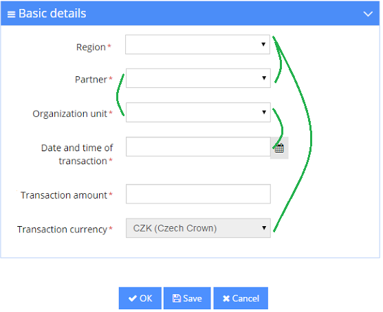
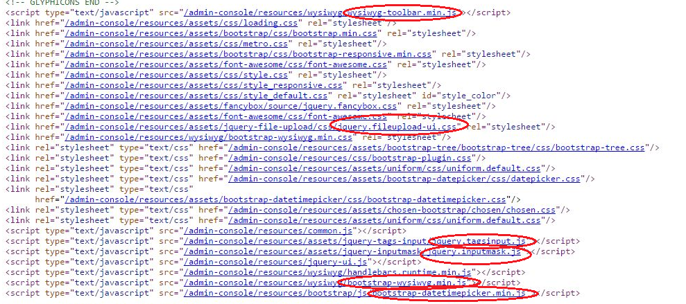

#CZJUG
##Hradec Králové
21.10.2015

---

## Outline
-   Spring Boot MVC
-   Pitfalls of web development
-   Webpack
-   Pitfalls of web development no.2
-   React.js
-   Spring + Webpack + React
-   JsxViewResolver

---

##Spring boot MVC
-   Takes an opinionated view of building production-ready Spring applications.
-   Quick application kick-off using [Starters](https://github.com/spring-projects/spring-boot/tree/master/spring-boot-starters)
-   Easy configuration via [properties file](http://docs.spring.io/spring-boot/docs/current/reference/html/common-application-properties.html)

--

### Add pom.xml fragments
```xml
<parent>
    <groupId>org.springframework.boot</groupId>
    <artifactId>spring-boot-starter-parent</artifactId>
    <version>1.2.6.RELEASE</version>
</parent>
<dependencies>
    <dependency>
        <groupId>org.springframework.boot</groupId>
        <artifactId>spring-boot-starter-web</artifactId>
    </dependency>
</dependencies>
```

--

### Create simple java class
```java
    package hello;
    import org.springframework.boot.*;
    import org.springframework.boot.autoconfigure.*;
    import org.springframework.stereotype.*;
    import org.springframework.web.bind.annotation.*;
         
    @Controller
    @EnableAutoConfiguration
    public class SampleController {
        
        @RequestMapping("/")
        @ResponseBody
        String home() {
            return "Hello World!";
        }
        
        public static void main(String[] args) throws Exception {
            SpringApplication.run(SampleController.class, args);
        }
    }
```

---

##Pitfalls of web development
-   Code duplicities and unused code (css)
-   tons of request to the server

--


--


---

##Webpack


--

##Webpack
-   Node.js module bundlerer for web
-   Other filetypes accessible using loaders
-   capable of multiple entry points
-   Sync and Async loading "code-splitting"

--

#webpack.config.js
```javascript
var webpack = require('webpack');
module.exports = {
    entry: ['./slides-loader.js'],
    output: {
        path: __dirname + '/build',
        filename: 'slides-loader.js',
        publicPath: 'build/'
    },
    module: {
        loaders: [
            { test: /\.css$/, loader: "style!css"},
            {test: /\.((svg)|(woff)|(woff)|(ttf)|(eot))$/, loader: 'file-loader', query: {name: '[name]\.[ext]'}} 
        ]
    }    
};

```

--

###Output
```html    
<script src="build/slides-loader.js" charset="UTF-8"></ script>
```        


---

##Pitfalls of web layer development no.2
-   Direct DOM manipulation
-   GUI elements cross dependencies 
-   missing data layer for GUI
-   overuse of plugins (JQuery)

--

###Direct DOM manipulation
```javascript
$.post('/login', credentials, function( user ) {
    // Modify the DOM here
    $('header .name').text( user.name );
    ...
});
```

--

###GUI elements cross dependencies 


--

###Missing single source of truth
-   multiple places for displaying same data
-   displayed data dependent on complex conditions

---

###Overuse of plugins



--

##React.js
-   It is only a view layer
-   gives you a template language and some function hooks to essentially render HTML
-   you can always tell how your component/GUI will be rendered by looking at one file
-   you cannot build a fully functional dynamic application with [React](http://facebook.github.io/react/) alone

--

###What it does not give you
-   build in event system
-   Ajax and callback handling (no Promises)
-   data layer
-   hint how to implement the above

###Component example
```javascript
var Header = React.createClass({
  getInitialState: function() {
      return {name: null};
   },
  render: function() {
    return <header>
            { this.state.name ?
                this.state.name :
                <span>Not Logged In</span> }
        </header>;
  }
});